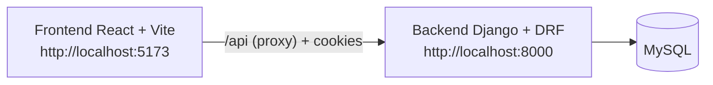

# Secure Wallet

Wallet web para registrar una cuenta, iniciar sesión y administrar métodos de pago de forma segura. No procesa pagos reales, saldos ni transferencias: el identificador sensible se valida al crearlo, se hashea y no se vuelve a exponer.

Este repositorio es una prueba técnica fullstack (Django + React + MySQL).

## Tecnologías

| Área | Stack real del proyecto |
| --- | --- |
| Frontend | React 19, React Router 7, Vite 8, Oxlint |
| Backend | Python, Django 5.2.17, Django REST Framework 3.18.0, django-cors-headers 4.9.0, python-dotenv 1.2.3 |
| Base de datos | MySQL (`mysqlclient` 2.2.8) |
| Autenticación | Usuario por defecto de Django, sesiones (`SessionAuthentication`), cookies, CSRF |
| Testing | `pytest` 9.1.1 y `pytest-django` 4.14.0 como dependencias; las pruebas actuales son `TestCase` / `APITestCase` de Django |

El frontend no incluye un runner de tests (Jest, Vitest, etc.). Oxlint se usa como linter (`npm run lint`).

## Arquitectura

El navegador sirve la SPA en el puerto **5173**. En desarrollo, Vite reenvía `/api` a Django en **8000**. Django autentica con la cookie de sesión, valida CSRF en métodos inseguros y persiste usuarios, métodos de pago y auditoría en MySQL.



Apps de Django:

- `users`: registro, login, logout, CSRF y perfil (`/api/auth/me/`).
- `payment_methods`: alta, listado paginado, detalle y desactivación.
- `audit`: registro de operaciones relevantes en base de datos.

El frontend no llama a MySQL: solo consume la API REST con `credentials: 'include'`.

## Funcionalidades

### Cuentas

- **Registro:** usuario, correo y contraseña. El correo se guarda en minúsculas y es único (validación + índice `uniq_auth_user_email`). La contraseña usa los validadores de Django (`AUTH_PASSWORD_VALIDATORS`).
- **Login / logout:** sesión de Django. Credenciales inválidas responden `401` con `Credenciales inválidas.`
- **Perfil:** no hay una ruta `/perfil`. La vista principal (`/`) muestra usuario y correo obtenidos de `GET /api/auth/me/`.

### Métodos de pago

Tipos soportados: `CARD`, `BANK_ACCOUNT`, `CLABE`, `OTHER`.

Cada método guarda alias, institución, moneda (código de 3 letras), tipo, estatus (`ACTIVE` / `INACTIVE`), `last_four` y un hash del identificador.

- **Listado** del usuario autenticado, ordenado por fecha de creación descendente.
- **Alta** con validación según el tipo (Luhn y 13–19 dígitos en tarjeta; CLABE de 18 dígitos; cuenta bancaria solo dígitos).
- **Detalle** por id, solo si pertenece al usuario y no está desactivado.
- **Desactivación** (soft delete): `deleted_at` + `status=INACTIVE`. Deja de aparecer en listado y detalle.
- **Reactivación:** si se vuelve a registrar el mismo identificador (mismo hash) de un método desactivado del mismo usuario, se reactiva y se actualizan alias, institución, moneda y tipo.
- **Duplicados:** un identificador activo no puede repetirse para el mismo usuario (`409`).
- **Paginación:** `PAGE_SIZE = 10`. El listado usa `?page=`. El frontend muestra controles de página cuando hay más resultados que los de la página actual.

Pantallas: registro, login, inicio (perfil + listado), alta, detalle y desactivación.

## Seguridad

Implementado en el código actual:

- **Sesión de Django**, no JWT. El cliente envía cookies (`credentials: 'include'`).
- **CSRF:** `CsrfViewMiddleware` + header `X-CSRFToken`. El frontend obtiene el token en `GET /api/auth/csrf/`, lo lee también de la cookie `csrftoken` y lo refresca después de login/logout (Django rota el token al autenticar).
- **CORS** con credenciales, origen `http://localhost:5173`.
- **Identificador:** no se persiste ni se devuelve. Se normaliza (sin espacios, mayúsculas), se calcula HMAC-SHA256 con `PAYMENT_IDENTIFIER_SECRET` y se guarda `identifier_hash`. En lecturas solo va `last_four`. El campo `identifier` del serializer es `write_only`.
- **Contraseñas:** `User.objects.create_user` (hash de Django).
- **Soft delete** de métodos de pago. El manager por defecto oculta filas con `deleted_at`.
- **Aislamiento:** listado, detalle y borrado filtran por `request.user`. Un usuario no accede a métodos de otro.
- **Auditoría en backend** (tabla `audit`): `REGISTER`, `LOGIN`, `LOGOUT`, `CREATE_PAYMENT_METHOD`, `DELETE_PAYMENT_METHOD`, `REACTIVATE_PAYMENT_METHOD`. Guarda usuario, recurso, IP y user-agent cuando hay `request`.
- **Secretos** vía `.env` (`SECRET_KEY`, base de datos, `PAYMENT_IDENTIFIER_SECRET`).

No implementado (no afirmar lo contrario):

- No hay API para consultar los logs de auditoría desde el frontend.
- `VIEW_PAYMENT_METHOD` existe en el modelo de auditoría, pero **no se escribe** al ver un detalle.
- No hay 2FA, recuperación de contraseña, roles ni pagos reales.
- CSRF y sesión en desarrollo usan `SameSite=Lax` y `SECURE=False` (HTTP local).

## Estructura del proyecto

```text
secure-wallet/
├── backend/
│   ├── config/                 # settings, urls, wsgi/asgi
│   ├── users/                  # auth API
│   ├── payment_methods/        # métodos de pago + servicios
│   │   └── services/           # HMAC, alta/desactivación
│   ├── audit/                  # logs de operaciones
│   ├── manage.py
│   ├── requirements.txt
│   └── .env.example
├── frontend/
│   ├── src/
│   │   ├── api/                # cliente HTTP, CSRF, recursos
│   │   ├── auth/               # sesión en el cliente
│   │   ├── components/
│   │   └── pages/
│   ├── package.json
│   └── vite.config.js
├── .gitignore
└── README.md
```

## Requisitos previos

- **Git**
- **Python 3.10+** (Django 5.2; el entorno de desarrollo usado fue 3.13)
- **Node.js 20.19+ o 22.12+** (requerido por Vite 8) y **npm**
- **MySQL** con un esquema y un usuario con permisos sobre esa base
- En Windows, `mysqlclient` necesita las librerías cliente de MySQL instaladas

No hay archivo `.python-version` ni `engines` en `package.json`.

## Variables de entorno

El backend carga un archivo `.env` con `python-dotenv` desde el directorio de trabajo (hay que ejecutarlo desde `backend/`).

Plantilla local: `backend/.env.example`. Copiarla a `backend/.env` y completar valores. **No subas `.env` ni secretos reales.**

| Variable | Uso |
| --- | --- |
| `SECRET_KEY` | Clave de Django |
| `DEBUG` | `True` / `False` |
| `DB_NAME` | Nombre de la base (ejemplo: `secure_wallet`) |
| `DB_USER` | Usuario MySQL |
| `DB_PASSWORD` | Contraseña MySQL |
| `DB_HOST` | Host (por defecto `localhost` si no se define) |
| `DB_PORT` | Puerto (por defecto `3306`) |
| `PAYMENT_IDENTIFIER_SECRET` | Secreto HMAC del identificador. Obligatorio al crear métodos; si falta, el servicio lanza error |

`ALLOWED_HOSTS` y CORS están fijos en código para `localhost` / `127.0.0.1` y `http://localhost:5173`.

## Instalación y ejecución

### Base de datos

Crear la base y un usuario coherentes con el `.env`. Ejemplo (ajustar nombres y contraseña):

```sql
CREATE DATABASE secure_wallet CHARACTER SET utf8mb4 COLLATE utf8mb4_unicode_ci;
CREATE USER 'wallet_app'@'localhost' IDENTIFIED BY 'your_password';
GRANT ALL PRIVILEGES ON secure_wallet.* TO 'wallet_app'@'localhost';
FLUSH PRIVILEGES;
```

Las tablas se crean con las migraciones de Django (incluye el índice único de email en `auth_user`).

### Backend

Desde la raíz del repositorio:

```bash
cd backend
python -m venv .venv
```

Activar el entorno:

- Windows (PowerShell): `.\.venv\Scripts\Activate.ps1`
- Linux/macOS: `source .venv/bin/activate`

```bash
pip install -r requirements.txt
```

Copiar `backend/.env.example` a `backend/.env` y editarlo.

```bash
python manage.py migrate
python manage.py runserver
```

API en `http://127.0.0.1:8000/`. El admin de Django queda en `/admin/` (no forma parte del flujo de la wallet).

### Frontend

En otra terminal:

```bash
cd frontend
npm install
npm run dev
```

UI en `http://localhost:5173`. Las llamadas a `/api` las proxifica Vite hacia `http://localhost:8000`.

Otros scripts: `npm run build`, `npm run preview` (también proxifica `/api`), `npm run lint`.

## Tests

Hay pruebas de backend en:

- `backend/users/tests.py` — email único, login
- `backend/payment_methods/tests.py` — normalización del identificador, validaciones y que las respuestas no incluyen el identificador completo
- `backend/audit/tests.py` — archivo vacío (sin casos)

No hay `pytest.ini`. La forma alineada con el código actual es, con el venv activo, `.env` cargado y desde `backend/`:

```bash
python manage.py test
```

Limitaciones conocidas:

- Django intenta crear la base `test_<DB_NAME>` (por ejemplo `test_secure_wallet`). Si el usuario MySQL **no tiene `CREATE DATABASE`**, los tests fallan aunque la app funcione.
- Las pruebas de métodos de pago usan `force_authenticate`; no cubren el flujo real de cookie de sesión + CSRF del navegador.
- No hay tests de duplicados (`409`), aislamiento entre usuarios, logout, auditoría, soft delete/reactivación ni tests de frontend.
- `pytest` está en `requirements.txt`, pero no hay configuración de proyecto para `pytest`; `python manage.py test` es el camino soportado hoy.

## API

Salvo `register`, `login` y `csrf`, los endpoints exigen usuario autenticado. `POST`, `PUT`, `PATCH` y `DELETE` requieren CSRF.

| Método | Endpoint | Descripción |
| --- | --- | --- |
| GET | `/api/auth/csrf/` | Devuelve `{ csrfToken }` y asegura la cookie CSRF |
| POST | `/api/auth/register/` | Crea usuario |
| POST | `/api/auth/login/` | Inicia sesión |
| POST | `/api/auth/logout/` | Cierra sesión |
| GET | `/api/auth/me/` | Perfil: `{ user: { id, username, email } }` |
| GET | `/api/payment-methods/?page=` | Listado paginado del usuario |
| POST | `/api/payment-methods/` | Alta o reactivación |
| GET | `/api/payment-methods/<id>/` | Detalle |
| DELETE | `/api/payment-methods/<id>/` | Soft delete / desactivación |

Alta: el body incluye `type`, `alias`, `institution`, `currency` e `identifier`. La respuesta nunca incluye `identifier`; sí `last_four`, `status`, fechas e id.

## Identificador de métodos de pago

El número completo (tarjeta, CLABE, cuenta u otro) solo viaja en el `POST` de alta. El backend:

1. Normaliza el valor.
2. Lo valida según el tipo.
3. Calcula HMAC-SHA256 y guarda `identifier_hash`.
4. Guarda los últimos 4 caracteres en `last_four`.
5. Descarta el identificador en claro.

Para decidir si dos registros son el mismo método se compara el hash por usuario, no el número original. El listado y el detalle solo muestran una máscara con `last_four`.

## Pendiente (fuera de este documento)

Ítems reales del código o de la entrega que **no** están cubiertos todavía:

- `.env.example` existe en `backend/`, pero puede no estar versionado en Git.
- No hay documentación de auditoría consultable en la UI.
- Acción de auditoría `VIEW_PAYMENT_METHOD` no se utiliza.
- Cobertura de tests incompleta (ver sección Tests).
- No hay filtros de listado más allá de la paginación.
- No hay diagrama de despliegue ni CI.
